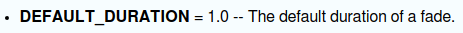
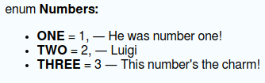

# Doctool

**Doctool** is a Perl-based program I've written for the sole purpose of generating doc files for my
custom classes, written in GDScript.

As of right now, the following goals are met:

- [X] Create "header" section with the class name and description
- [X] Create "properties" section with a list of exported properties
- [X] Create "signals" section with a list of defined signals
- [X] Create "methods" section with a list of exposed methods
- [X] Create "constants" section with a list of defined constants
- [X] Create "enums" section with a list of defined enumerations
- [ ] Automatically build a table of contents for the HTML output

## Version History

I am currently developing Doctool and it should not be considered stable yet. The current version of Doctool can be found [here](VERSION).
A list of changes made to each version can be found [here](CHANGES).

## Installation

Simply extract the contents of the archive into its own directory. Or clone this repository for the same effect.

### Dependencies

* Perl version 5.10 or later
* Perl modules
    * String::Util
    * Readonly

You can install Perl modules from the commandline, and there are two ways to do so.

#### Method 1

The method I use is to go into the cpan shell by typing `cpan`.
You will see a line that says `cpan[1]>` or something similar---that is the command prompt.

From the command prompt, you type the following:

    install MODULENAME

Replacing "MODULENAME" with the actual name of the module you want to install
(see [Dependencies](#dependencies)).

However, the Perl developers and module creators seem to recommend method 2.

#### Method 2

Type this into the console:

    cpanm MODULENAME

This is a slightly quicker (less typing) way of installing a module.
If you do not have cpanm installed, you can do method 1 above or install a package named "cpanminus"
using your package manager.

## Usage

	class_doctool FILE

Doctool reads from a file written in GDScript and prints HTML to standard output. The HTML is produced using
`template.html` according to the rules outlined in this document (to be written).

<!-- TODO: create file that describes how template.html is used. -->

## Class Documentation Syntax

To write a documentation for the class, a property, etc., you write what is called a documentation block preceding the
actual declaration of the documented entity.

A comment starting with two pounds is used for a brief one-line description of the code. It's also what Doctool looks for to start
a documentation block.

	## Brief description
	# @desc Full description.
	export(bool) var flag = false

### Tags

Any word that starts with '@' is a tag. Documentation blocks have their own unique set of tags.

This section defines the three different types of tags and what they do. In addition, tags which are universal (can be used anywhere)
are listed under their respective headers.

#### Section Tags

A section tag starts a section in the documentation block. A section can have more than one paragraph.

&bullet; `desc`  
Starts a section of the documented entity for the description.
Currently this is the only section tag that Doctool supports.
This may change in future versions.

#### Formatting Tags

Defined as inline tags which affect the formatting of text. Their syntax is as follows:

    @tag text
    @tag{multiword text}

The first form modifies the formatting of a single word, and the second form affects whatever is enclosed between the braces.

&bullet; `a`  
Used to denote an argument, either to a function or a signal.
Italicizes the tag-parameter.

&bullet; `b`  
Emboldens the tag-parameter.

&bullet; `class`  
Encloses the tag-parameter in HTML `<code="class">` tags, which has different formatting than
generic `<code>` tags.

&bullet; `code`  
Encloses the tag-parameter in HTML `<code>` tags.

&bullet; `function`  
Encloses the tag-parameter in HTML `<code="function">` tags, which has different formatting than
generic `<code>` tags.

#### Data Tags

There are no universl data tags; each type of docmentation contains its own unique set of data tags. Check the sections
describing each type of doc to see their data tags.

## Documentation Basics

### Terminology

These terms are used when referring to parts of a GDScript file.

&bullet; tag  
A tag is identified by an at-sign followed a word.
An example of one would be `@desc`.
There are three types of tags, differentiated by how they're parsed: section tags, data tags, and formatting tags.

&bullet; tag-parameter  
Refers to a parameter taken in by a tag.

&bullet; documentation block  
Used to describe a block of comments followed and delimited by the first line of code, typically the entity being documented.
A documentation block is recognized by a pair of pound signs at the beginning of a line and consective lines of single-pound comments.

## Class Documentation Structure

### Class

To begin processing a file, Doctool needs to see a [documentation block](#definition_documentation-block)
at the top of the file.
This documentation block covers the class itself.

    ## Brief description of the class.
	# @desc  A multi-paragraph description of the class.
	#
	#        A second paragraph.
	class_name ClassName
	extends BaseClass

Notice the inclusion of `class_name` and `extends`.
Both of those declarations are necessary in order for Doctool to process this file.
However, instead of `class_name` you can use a `@name` tag in the body of the documentation block to
tell Doctool what to use as the name of the class. Without either of these, Doctool will emit an error and abort.

Example1:

    ## Container and controller of states
    # @desc  A StateMachine controls the state of an object, referred internally as the persistent state.
    #        Any child that is a @class State will be added to an internal array of states.
    #        The first child that is a @class State will be the first index in said array, and so on.
    #
    #        To change which state is currently active, call @function change_state.
    class_name StateMachine
    extends Node

Example 2:

	## Container and controller of states
	# @name StateMachine
	# @desc  A StateMachine controls the state of an object, referred internally as the persistent state.
    #        Any child that is a @class State will be added to an internal array of states.
    #        The first child that is a @class State will be the first index in said array, and so on.
    #
    #        To change which state is currently active, call @function change_state.
	extends Node

#### Data Tags

Unless otherwise noted, these tags are optional.

&bullet; `name`  
Syntax: `@name NAME`  
If this tag is present, *NAME* is used for the name of the documented class.
**Note:** this tag is mandatory if no `class_name` expression is found.

&bullet; `singleton`  
Syntax: `@singleton`  
This tag tells Doctool that the class being documented is a singleton (also known as an autoload in Godot).

### Properties

Godot has exported properties, which are visible in the editor and can be considered the "parameters"
of the object.
Such properties are documented in their own section of the documentation.

This is a real-life example of an exported property from one of my own classes.

    ## The node being manipulated by the states
    # @type  NodePath
    # @desc  This path refers to a @class Node which acts as the persistent state of the
    #        machine. Basically, it is the parent of all the states, the main state from which
    #        the other states are working.
    export(NodePath) var root_node: NodePath

Doctool reads the property definition to get the name of the property, so there is no need for a tag
that specifies the name.

Doctool is looking for *exported* properties, which means that the `export` keyword should be there;
however, Doctool doesn't require the `export` keyword in order to document the property.
Consequently, all of the following lines are permitted.

    # With 'export'
    export(String) var file = ""
    export var file: String = ""
    export var file := ""
    # Without
    var file = ""
    var file: String = ""
    var file := ""

Why does Doctool now require `export` for exported properties?
Because there are properties that can be exported through the `_get_property_list` method.
As a matter of fact, I do that for some of my own classes, which is why I made it this way.

#### Data Tags

Unless otherwise noted, these tags are optional.

&bullet; default  
Syntax: `@default VALUE`  
Indicates that *VALUE* is this property's default value.

&bullet; getter  
Syntax: `@getter FUNCTION`  
Indicates that *FUNCTION* is this property's registered getter function.

&bullet; setter  
Syntax: `@setter FUNCTION`  
Indicates that *FUNCTION* is this property's registered setter function.

&bullet; type (required)  
Syntax: `@type TYPE`  
Describes the type of the property---this tag is *required* for Doctool to accept this property.

### Constants

This block...

    ## Some random constant
    const SOME_CONSTANT = 0

...produces this HTML output (according to the default configuration of `template.html`):

The `const` keyword, the name of the constant, and the value are necessary.

There are no data tags associated with constants.

A description is allowed for this entity, the same as any other.

### Enumerations

The brief is not necessary; you can leave it empty, but the "##" must still be there.

	## A bunch of numbers.
	enum Numbers {
		ONE = 1, ## He was number one!
		TWO = 2, ## Luigi
		THREE = 3 ## This number's the charm!
	}

This documentation block produces this output in HTML (according to the default configuration of `template.html`):

There are no tags specific to

### Signals

Here is a signal that I defined for one of my classes.

    ## Indicates that the state should be changed.
    # @arg  int  new_state  An integer denoting the desired state
    # @desc                 The @class StateMachine reacts to this signal and
    #                       changes to the state indiciated by @i new_state.
    signal state_change_request(new_state)

Like with properties, Doctool gets the name of the signal by reading the signal definition.
In this example the name of the signal is `state_change_request`.

#### Data Tags

Unless otherwise noted, these tags are optional.

&bullet; arg  
Syntax: `@arg TYPE NAME BRIEF`  
This tag describes one of the signal's parameters and causes it to be included in the signal documentation.
The tag-parameters are, in order: the type of the signal argument, its name, and a brief description of it.
If all three tag-parameters are not provided, then *NAME* will be excluded from the documentation.

### Methods

Methods are easily the most complicated part of this yet.
Here is an example of what I mean:

    ## Change to a different state
    # @desc  Call this function to switch to a different state in the machine.
    #        If @arg next_state exists, then the state machine switches to that state immediately.
    #
    #        Before switching to a new state, the old state's @function cleanup method is invoked.
    #        Then after switching to the new state, its @function setup method is invoked.
    func change_state(next_state: int) -> int:
        ...

Unlike the other sections, Doctool completely relies on reading the function signature to get
things like the name, parameters, and the return type.
As you can see, the example function returns `int`.
But if no return type is specified for this method, Doctool just lists it as `Variant`.
